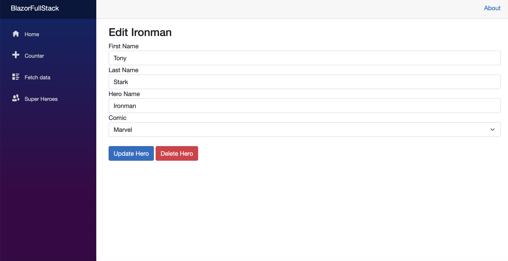
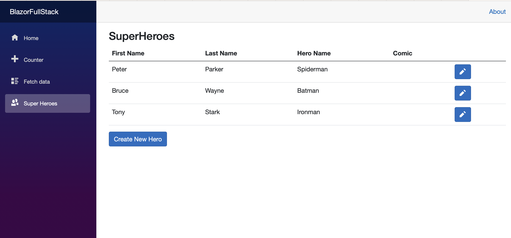

# BlazorFullStack

## Description

This is a basic .NET Blazor web application designed for superhero management. You can add, edit, and delete superheroes via the web interface and also directly modify data in the database.

## Features

- Add new superheroes with their names, comics type.
- Modify attributes of existing superheroes.
- Delete superheroes from the list.
- Interactive web interface for easy data management.
- Ability to make direct changes to the database if needed.
